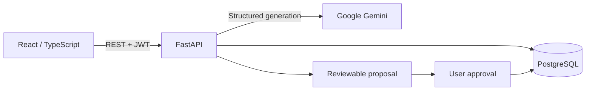

# StudyFlow

A full-stack study planner with an AI assistant, review scheduling, and a calendar. Built as a portfolio project with React, TypeScript, FastAPI, and PostgreSQL.

StudyFlow turns a learning goal into a reviewable draft. Users can refine the draft before saving it, schedule study sessions, and track completed work. AI suggestions are learning aids, not guarantees of accuracy or exam results.

## Features

- **Study organization:** subjects, topics, tasks, deadlines, priorities, subject archiving, and bulk actions.
- **T3ACH assistant:** conversational planning, clarification questions, revisions, conversation history, and optional voice input and output.
- **AI materials:** structured notes and dated study plans. Preview and regenerate before explicitly approving a save.
- **Calendar:** exam dates, plan days, draggable tasks, Google Calendar links, and iCalendar export.
- **Progress:** completed study sessions, daily and weekly totals, streaks, and spaced review reminders.
- **Personalization:** English and Polish, time zone, keyboard shortcuts, light/dark themes, and accent colors.
- **Offline alternatives:** write a note or prepare a basic plan without an AI provider.

## How it works



The browser never receives the provider API key. The backend validates structured AI output and applies calendar constraints. Planned sessions create tasks; completed sessions contribute to study statistics. Saving a proposal requires explicit approval and cannot be repeated for the same proposal.

## Technology

| Layer | Tools |
| --- | --- |
| Frontend | React, TypeScript, Vite, Lucide icons |
| Backend | Python, FastAPI, Pydantic, SQLAlchemy |
| Data | PostgreSQL, Alembic migrations |
| Authentication | JWT bearer tokens, Argon2 password hashing |
| AI | Google Gemini structured responses and speech |
| Deployment | Docker Compose, Nginx, optional Caddy for local HTTPS |
| Testing | pytest, PostgreSQL integration tests, Node tests, Chromium smoke checks |

## Quick start

Requirements: Docker Engine or Docker Desktop with Docker Compose.

```sh
cp .env.example .env
```

Edit `.env` before starting:

- Set `JWT_SECRET_KEY` to a random secret of at least 32 characters, for example the output of `openssl rand -hex 32`.
- Set `DB_PASSWORD` to your own password.
- Set `GEMINI_API_KEY` if you want AI generation. Manual notes and basic plans do not require it.
- Review `CORS_ORIGINS` and exposed ports for your environment.

```sh
docker compose up -d --build
```

| Service | Local address |
| --- | --- |
| Web application | http://localhost:5173 |
| API documentation | http://localhost:8000/docs |
| Readiness check | http://localhost:8000/health/ready |

Database migrations run automatically when the API container starts. Data persists in a Docker volume.

### Access from another computer

For microphone access, use HTTPS. Set `LAN_HOST` in `.env` to the host computer's local IP address, then start the optional proxy:

```sh
docker compose --profile lan up -d lan-https
```

Open `https://<LAN_HOST>:8443` on the other device. Caddy uses a local certificate authority; the client device must trust that authority. Both devices must be on the same network and the host firewall must allow the configured port.

## Language settings

English is the default language. The globe button in the corner of the login and registration form opens the **English / Polski** menu. After login, the language selector is at the top of the profile menu, above **Account settings**. An explicit choice before login updates the account preference; otherwise the saved account preference is restored. Newly generated AI content follows the selected language; existing notes, conversations, and user-entered names retain their original content.

English source messages and separate Polish catalogs keep presentation text out of application logic. Polish phrases in parsing rules and regression fixtures are intentional: both languages remain supported. Existing database column names and migration identifiers are retained for compatibility with saved data.

## Local development

Use Python 3.13, Node.js 22+, and PostgreSQL. Configure `.env` for a database reachable from the host.

```sh
python -m venv .venv
source .venv/bin/activate
# Windows PowerShell: .venv\Scripts\Activate.ps1
python -m pip install -r requirements.lock
alembic upgrade head
uvicorn app.main:app --reload
```

In a second terminal:

```sh
cd frontend
npm ci
npm run dev
```

Set `VITE_API_URL=http://localhost:8000` when running the frontend directly against the API. The containerized frontend uses `/api` through Nginx.

Dependency versions are recorded in `requirements.lock` and `frontend/package-lock.json`. Update and verify these files deliberately when changing dependencies.

## Tests

Run the backend suite with an isolated PostgreSQL service:

```sh
docker compose --profile test run --rm --build tests
docker compose --profile test run --rm -v "$PWD/legacy_cli:/app/legacy_cli:ro" --entrypoint python tests -m pytest legacy_cli/test_functions.py -q
```

The test fixture recreates tables. **Never set `TEST_DATABASE_URL` to a database containing real data.** Without that variable, backend tests use an in-memory SQLite database. Provider calls are mocked in the regular suite.

```sh
python -m pytest tests -q
cd frontend
npm ci
npm run build
node --experimental-strip-types --test tests/*.test.mjs
```

Coverage includes account isolation, CRUD, authentication failures, AI approval, multi-turn revisions, date scheduling, calendar synchronization, bulk deletion, export escaping, and recovery from provider errors. Browser smoke scenarios are documented under `audits/` and use controlled API responses.

## Repository layout

```text
app/
  core/             Configuration, security, logging, and localization
  db/               Database setup
  models/           SQLAlchemy models
  routers/          REST endpoints
  schemas/          Request and response validation
  services/         Study, planning, AI, and export logic
alembic/            Versioned database migrations
frontend/
  src/              React application and localization catalogs
  tests/            Frontend regression tests
tests/              Backend integration and regression tests
audits/             Audit findings, repair reports, and browser scenarios
legacy_cli/         Archived command-line interface
docker/             Entrypoint and local HTTPS configuration
```

## API overview

Authenticate through `/auth/login`, then send `Authorization: Bearer <token>` to protected endpoints. The interactive OpenAPI documentation is the full API contract.

| Resource | Main endpoints |
| --- | --- |
| Account | `/auth/register`, `/auth/login`, `/users/me` |
| Study data | `/subjects`, `/topics`, `/tasks`, `/study-sessions`, `/exam-results` |
| Material drafts | `POST /ai/materials/draft` |
| Assistant | `POST /ai/t3ach/propose`, `POST /ai/t3ach/execute` |
| History | `/ai/materials`, `/ai/t3ach/history`, `/ai/history/bulk-delete` |
| Plans and reviews | `/plans`, `/reviews` |
| Export | `/calendar/export.ics`, `/ai/materials/{id}/export.md`, `/ai/materials/{id}/print` |

List endpoints for core study resources use `page` and `page_size` with a maximum page size of 100. Bulk history deletion accepts up to 1000 IDs per request. Send `Accept-Language: en` or `Accept-Language: pl` for localized API messages.

## Operations and troubleshooting

```sh
docker compose ps
docker compose logs --tail=100 api
docker compose exec api alembic current
docker compose up -d --build api frontend
```

- **AI unavailable:** verify the provider key, model configuration, quota, and API logs. Use the manual alternatives while the provider is unavailable.
- **Changes not visible:** rebuild the affected service and reload the page.
- **API not ready:** check database connectivity and migration status at `/health/ready`.
- **Port conflict:** adjust `FRONTEND_PORT`, `API_PORT`, or `POSTGRES_PORT` in `.env`.

HTTP logs include the method, route, status, duration, and a request ID. The ID is returned as `X-Request-ID`. Avoid sharing logs or audit artifacts containing personal content.

## Deployment boundaries

This is an actively developed MVP. Before exposing it publicly:

- keep `.env`, database dumps, provider keys, and real user data out of version control;
- configure trusted HTTPS, restricted origins, backups, and provider spending limits;
- use a shared, persistent rate limiter for multiple API processes;
- consider session revocation and refresh-token requirements for your deployment.

Per-account login lockouts are persisted in the database. General request limits currently live in API process memory. Voice support depends on the browser and device. Automated tests and targeted audits reduce risk; they are not a comprehensive penetration test or a guarantee that generated study content is correct.

## Project history

The archived console application is in [`legacy_cli/`](legacy_cli/README.md). Audit findings and verification evidence are in [`audits/`](audits/README.md). These documents distinguish reproducible defects, completed fixes, and remaining test limitations.
